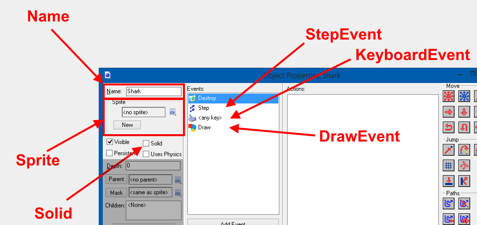

# AI Application

# The Static Game Class

The Game class is implemented with several features to create a custom game level.

### `Game:New() : Entity`
Initializes a new GameObject, adds it to the Game, and returns it.

### `Game:SetWindowSize(int width, int height) : void`
Sets the window size of the game.

### `Game:Destroy(Entity) : void`
Deletes this Entity from the game.

# The Entity Class
The Entity class is the basic class for game objects. To save the hassle of having to deal with abstract MovingEntities (Because Lua doesn't really enjoy abstraction), each Entity comes with predefined movement physics. Solid entities halt the usage of moving around completely.

Name | Type | Description
--- | --- | ---
Name | string | The entity's name. Useful for debugging.
Tag | string | The entity's group tag.
Position | Vector2 | The entity's relative position inside the game.
Velocity | Vector2 | The entity's velocity, aka movement vector.
Solid | boolean | Whether the entity is solid (can move) or not.
Sprite | Sprite | The entity's default sprite to render.
StepEvent | Action\<Entity\> | The Action this entity will do on each game update tick.
KeyboardEvent | Action\<EventKeyArgs, Entity\> | The keyboard Action this entity will do on each game update tick.
DrawEvent | Action\<Graphics, Entity> | The drawing Action this entity will do on each game render tick.

The Events work slightly like Game Maker's.


Example of the Step event:
```lua
-- Move the entity to the right with each game tick.
Entity.StepEvent = function(entity)
  entity.Position.X = entity.Position.X + 2
end
```

Example of the Keyboard event:
```lua
-- Move left if the user pressed the A key
Entity.KeyboardEvent = function(kb, entity)
    if(kb.Key == Keys.A) then
        entity.Position.X = entity.Position.X - 2
    end
end
```

Example of the Draw event:
